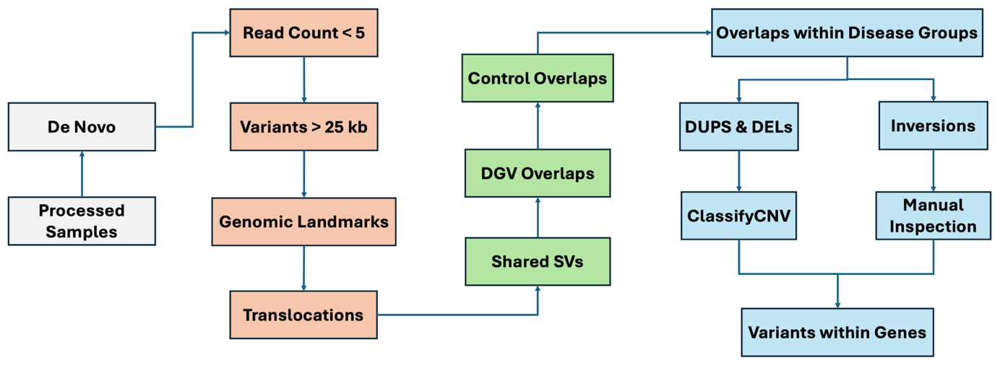

# Structural Variants in Insulin Regulation: A Study on Neonatal Diabetes and Hyperinsulinism

## Overview

This repository contains the code and analysis for my dissertation project titled **"Structural Variants in Insulin Regulation: A Study on Neonatal Diabetes and Hyperinsulinism"**. The project explores the role of **Structural Variants (SVs)** in rare conditions such as **Neonatal Diabetes Mellitus (NDM)** and **Congenital Hyperinsulinism (CHI)**. These conditions affect the body's regulation of insulin, with NDM causing insufficient insulin production and CHI leading to excessive insulin secretion. The primary aim of the study is to identify overlapping **de novo** structural variants in individuals with NDM and CHI, which may uncover novel mechanisms of disease.

## Repository Contents

### 1. Data Cleaning (`Data_Cleaning.ipynb`)
This notebook contains the preprocessing steps for the dataset, including:
- Consolidation of raw data into a unified format
- Genotype assignment to detect inheritance patterns of variants
- Cleaning and standardization of genomic coordinates

### 2. Exploratory Analysis (`Exploratory_Analysis.ipynb`)
The exploratory analysis focuses on:
- Identifying the distribution of variant frequencies across samples
- Detecting outliers and potential sequencing errors
- Visualizing the distribution of genetic consequences (e.g., deletions, duplications, inversions)

### 3. Variant Filtering (`Filtering.ipynb`)
This notebook outlines the steps taken to filter out irrelevant or unreliable variants and focus on **de novo SVs**:

**Sample processing (grey):**
- Raw sequencing data files were restructured and standardized into a unified format using custom Python scripts.
- Assigned genotype values by analysing the number of reads aligning at specific genomic locations for probands and their parents.
- Only retained variants present exclusively in the proband and not parents (De Novo)

**Removed unreliable variant calls (orange), including:**
- genomic landmarks and translocations,
- variants with low read counts (<5) and large variants (>25kb) difficult to validate.

**Excluded variants likely to be benign (green), including:**
- Used bedtools to filter out variants overlapping with the Database of Genomic Variants (DGV) Gold Standard (>90% overlap), removing known benign variants.
- variants shared between NDM and CHI cohorts.
- variants present in previously solved cases (controls).

**Overlaps within each disease group are identified (blue):**
- Developed a custom python script which sorts through SV by chromosome and genomic coordinates then groups each SV that overlap and occur in different samples within the same disease group.
- ClassifyCNV was used to identify duplications and deletions occurring in genes (while also providing a pathogenicity score)
- Inversions had to be manually checked on IGV.
- Only those occurring in genes were retained for further analysis and validation.

## Project Aim

The goal of the project is to leverage whole genome sequencing data to identify and validate **de novo structural variants** that could explain the genetic basis of **Neonatal Diabetes Mellitus** and **Congenital Hyperinsulinism**. By focusing on **high-confidence structural variants**, we aim to uncover novel pathways involved in insulin regulation.

## Methods:
Sample Collection: Whole genome sequencing was performed on 89 patients with NDM and 103 patients with CHI, along with their parents.
SV Detection: Used short-read paired-end sequencing data and Matthew’s FindLargeInsertSize software to detect SVs based on variations in paired-end read distances and orientations.

### Key Findings
- The filtering process resulted in the identification of 20 candidate de novo SVs in the NDM cohort and 23 in the CHI cohort.
- Inversions were identified in the **IFITM** gene cluster, and deletions were found in **MTUS2**, suggesting potential novel genetic contributors to CHI.
- Further functional validation is required to confirm the contribution of these genes to the disease.

## Dissertation

The complete dissertation is available in the file **"700009050.pdf"**. It provides detailed background, methods, and results of the study, including:
- An overview of structural variant detection methods
- Detailed results of the exploratory analysis and variant filtering
- Discussion of the potential role of the **IFITM** gene cluster in insulin regulation
- Future directions for functional validation and research on machine learning approaches to variant analysis.

## Future Work

### 1. Functional Validation
- Further validation using **long-read sequencing** is required to confirm the identified structural variants.
- Techniques like **CRISPR/Cas9** and **single-cell RNA sequencing** are proposed to explore the functional consequences of the identified variants.

### 2. Machine Learning Approaches
- Future work could involve the integration of **machine learning** to improve variant calling and filtering, allowing for more accurate detection of SVs in large datasets.

